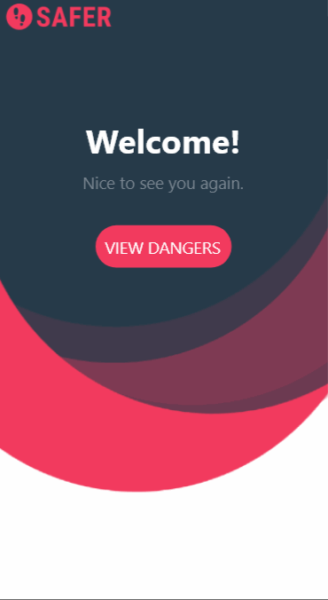

Unit 8: Group Milestone - Safer
===

# Safer

## Table of Contents
1. [Overview](#Overview)
1. [Product Spec](#Product-Spec)
1. [Wireframes](#Wireframes)

## Overview
### Description
An andriod navigation map app where you can share and view dangers nearby, and it guides you to the nearest security help in Hyde Park Region in Chicago, IL.

### App Evaluation
- **Category:** Social Networking / Public Service / Navigation
- **Mobile:** This app would be primarily developed for mobile but would perhaps be just as viable on a computer. Functionality wouldn't be limited to mobile devices, however mobile version could potentially have more features.
- **Story:** Analyzes posts the accidents by writing posts, taking pictures and videos. Users are also allowed to comment and share others' posts.
- **Market:** We plan to take campus area in the United States as our primary playground, due to the transportation data availability.
- **Habit:** If you live in a dangerous neighborhood... You will love it.

## Product Spec
### 1. User Stories (Required and Optional)

**Required Must-have Stories**

* The "danger map" is open to everyone who download this App!
* To post a new danger, user needs to login. We provide Google OAth login and customized sign up activity.
* Time, location, description are necessary parts when a user composes a new danger. You can choose the location of accident directly from map.
* Users can take photos and videos about the accidents.
* View a list of recent dangers, and also the dangers posted by this user.
* We provide real-time traffic/shelter location on the map. Just head to a safer place to keep safe!

**Optional Nice-to-have Stories**

* One-time chat for users to group up if they would like to share the taxi or shuttle.

### 2. Screen Archetypes

* Login 
* Register - User signs up or logs into their account
   * Upon Download/Reopening of the application, the user is prompted to log in to gain access to their profile information to be properly matched with another person. 
   * ...
* Main Map Screen - with danger pinned
   * Floating window with danger details upon clicking the danger icons
* Profile Screen 
   * Allows user to upload a photo and fill in information that is interesting to them and others
* Post-a-Danger Screen
   * Time, location, description, photos, video composing
   * Select location on map
* List of recent dangers
   * Recycler view that allows filtering

### 3. Navigation

**Tab Navigation** (Tab to Screen)

* List of dangers
* Main map
* Add a danger
* Profile

## Wireframes
 

==
## Preview
