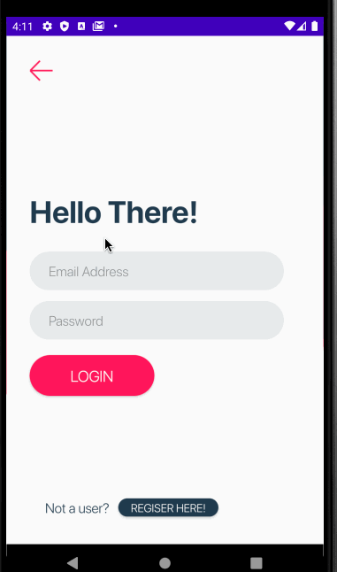

CodePath Android University Group Project
===

# Safer

## Table of Contents
1. [Overview](#Overview)
1. [Product Spec](#Product-Spec)
1. [Wireframes](#Wireframes)
2. [Schema](#Schema)

## Overview
### Description
An android navigation app where users can share and view dangers nearby. The app will also guide you to the nearest security help in Hyde Park Region in Chicago, IL.

### App Evaluation
[Evaluation of your app across the following attributes]
- **Category:**
- **Mobile:**
- **Story:**
- **Market:**
- **Habit:**
- **Scope:**

## Product Spec

### 1. User Stories (Required and Optional)

**Required Must-have Stories**

* [fill in your required user stories here]
* ...

**Optional Nice-to-have Stories**

* [fill in your required user stories here]
* ...

### 2. Screen Archetypes

* [list first screen here]
   * [list associated required story here]
   * ...
* [list second screen here]
   * [list associated required story here]
   * ...

### 3. Navigation

**Tab Navigation** (Tab to Screen)

* [fill out your first tab]
* [fill out your second tab]
* [fill out your third tab]

**Flow Navigation** (Screen to Screen)

* [list first screen here]
   * [list screen navigation here]
   * ...
* [list second screen here]
   * [list screen navigation here]
   * ...

## Wireframes

### [BONUS] Digital Wireframes & Mockups
[Digital Wireframe] https://github.com/ZhouXing19/Safer/tree/master/design/digital_wireframe.pdf
### [BONUS] Interactive Prototype

## Schema
[This section will be completed in Unit 9]
### Models
[Add table of models]
### Networking
- [Add list of network requests by screen ]
- [Create basic snippets for each Parse network request]
- [OPTIONAL: List endpoints if using existing API such as Yelp]

## Technology
- Java
- Google Map API
- Firebase
- Adobe XD for UI design

## Preview
 

## Environment
- Developed in AndroidStudio 4.0.1
- Tested in Pixel 2 API 30
- A [fake location simulator](https://play.google.com/store/apps/details?id=com.lexa.fakegps&hl=en_US&gl=US) is needed in the AVD

## Implemented Functions

- User sign up
- User sign in
- Map interface
- Current Location
- "Submit danger nearby" page
- "Pick a location from map" page (developing)

## TO-DO
- `PickLocationActivity.java`, complete the location acquisition function on click.
- `PostDangerActivity.java`, change the address that user inputs into lat-lang, and save in DB.
