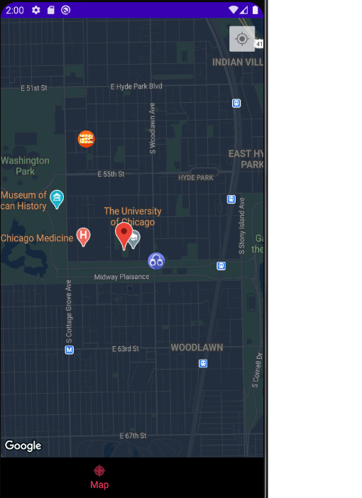

CodePath Android University Group Project
===

# Safer

## Table of Contents
1. [Overview](#Overview)
1. [Product Spec](#Product-Spec)
1. [Wireframes](#Wireframes)
1. [Schema](#Schema)

## Overview
### Description
An android navigation app where users can share and view dangers nearby in Hyde Park Region in Chicago, IL.

### App Evaluation
- **Category:** Safety
- **Mobile:** This application will be a mobile solution.
- **Story:** Students and local residents are now aware of crimes or dangers nearby. They have more control over their own safety.
- **Market:** This app will be primarily targeted towards students that attend college.
- **Habit:** Students will most likely use this app at night if they are walking alone, or during the day when they are notified of a nearby danger.
- **Scope:** This project will enable students to see nearby dangers and be able to alert others of dangers they have noticed.

## Unit 9: Milestone Deliverables
- [X] Updated README with Schema Section - Check out an EXAMPLE README
- [X] Data Models (3pts)
- [X] Networking (2pts)
- [X] Sprint Plan in place using GitHub project management flow.
- [X] GitHub Project created (1pt)
- [X] GitHub Milestones created (1pt)
- [X] GitHub Issues created from user stories (2pts)
- [X] Issues added to project and assigned to specific team members (1pt)

### Trello: Milestones and Issues


### Trello: Sprint Plan and assigned team members


### Lynn
- RV Clickable cell + pull to refresh


### Molly
- Retrieve real time data from firebase
- Display danger icon and floating window


### Zhou
- Updated database schema: added entries for title, category and LatLng


## Product Spec

### 1. User Stories (Required and Optional)

**Required Must-have Stories**

- [X] Users can log in to post a danger notice
- [ ] All nearby dangers are displayed on a map
- [ ] An aggregated list of dangers can be viewed
- [X] Each danger has a detailed page with the respective image or video

**Optional Nice-to-have Stories**

* Navigation to safe locations such as police stations, hospitals, or other shelters

### 2. Screen Archetypes

* Login Page
   * Map with pinned danger locations
   * Filter/Toggle danger types
* Main Activity Page/Map
   * Map with pinned danger locations
   * Filter/Toggle danger types
* Danger Posting Page
   * Address autocompletion
   * Get address by pin on map
   * Latitude/Longitude information
   * Post Pictures and Videos
   * Post with categories
* Danger Viewing Page
   * Recycler view, with each row showing address, time, description
* Danger Detail Viewing Page
   * Imageview / videoview
   * Description view
   * Comment view
   * Comment input
* Profile Page

### 3. Navigation

**Tab Navigation** (Tab to Screen)

* Map
* Post Danger
* Nearby Dangers

**Flow Navigation** (Screen to Screen)

* Welcome Page
   * Main Map Page
* Main Map Page
   * Nearby Danger Page
   * Post Danger Page (logged in)
   * Login Page/Register Page
* Nearby Danger Page
   * Danger Details Page
* Danger Details Page
   * Edit Danger Page
* Post Danger Page
   * Danger Details Page
* Profile Page
   * Main Map Page
   
## Wireframes


### [BONUS] Digital Wireframes & Mockups
[Digital Wireframe] https://github.com/ZhouXing19/Safer/tree/master/design/digital_wireframe.pdf
### [BONUS] Interactive Prototype


## Schema 
### Models
1. Danger Schema

   | Property      | Type     | Description |
   | ------------- | -------- | ------------|
   | category      | String   | danger's category |
   | description        | String| danger description |
   | id     | String| unqiue id of danger |
   | imageUrl         | String     | image url from Firebase storage |
   | latitude       | double   | latitude of danger |
   | location | String   | location of danger |
   | longitude    | double   | longitude of danger |
   | time     | DateTime | date and time this danger occured |
   | title     | String | title of danger |
   | userId     | String | unique id of user that created this danger post |
   
2. User Schema

   | Property      | Type     | Description |
   | ------------- | -------- | ------------|
   | dangerid        | String| id of danger the user posted |
   | email       | String   | user's email |
   | firstName    | String   | user's first name |
   | id     | String   | unique id of user |
   | imageUrl         | String     | user's profile image |
   | lastName     | String | user's last name |
   | password | String   | user's password |

### Networking
#### List of network requests by screen
   - Main Map Activity Screen
      - (Read/GET) Get all dangers from Firebase
         ```java
         DatabaseReference ref = FirebaseDatabase.getInstance().getReference().child("Danger");
        // Attach a listener to read the data at our posts reference
        ref.addValueEventListener(new ValueEventListener() {
            @Override
            public void onDataChange(DataSnapshot dataSnapshot) {
                for (DataSnapshot snapshot: dataSnapshot.getChildren()) {

                    DangerHelperClass danger = snapshot.getValue(DangerHelperClass.class);
                }
            }
         }
         ```
   - Create Danger Screen
      - (Create/POST) Create a new danger 
      - (Update) Update a danger
      - (Delete) Delete a danger
   - Profile Screen
      - (Create/POST) Add a new user to the database
      - (Read/GET) Get user's information
      - (Update/PUT) Update user's profile image

## Technology
- Java
- Google Map API
- Firebase
- Adobe XD for UI design
- Joda Time

## Environment
- Developed in AndroidStudio 4.0.1
- Tested in Pixel 2 API 30
- A [fake location simulator](https://play.google.com/store/apps/details?id=com.lexa.fakegps&hl=en_US&gl=US) is needed in the AVD

